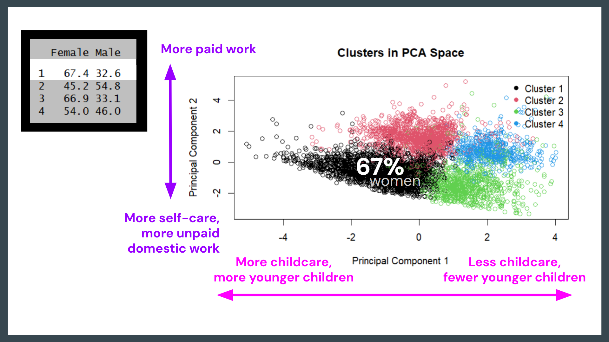

## Data and Cleaning

::::: columns
::: {.column width="40%"}

Dataset: IPUMS Time Use

-   Collection of time diary data
-   American Heritage Time Use Study Extract Builder
-   From 1930 to 2018, harmonized for comparison over time

Filters:

-   Day: M-F
-   Household type: married with kids
-   Kids under 18 in household
-   Working-age individuals (25 through 54)
-   College educated
-   Filter out missing/dirty values (wage, sex, time use)
-   Year: 2010s

Transformations:

-   Convert categorical variables to factors
-   Convert time use variables to hours per day
-   Combine time spent on child care and domestic work into one "unpaid
    domestic work" variable
:::

::: {.column width="60%"}
```{r codebook, echo=FALSE, warning=FALSE, message=FALSE}
library(kableExtra)

# define codebook
codebook <- tibble::tribble(
  ~Variable, ~Description, ~Type,
  "WAGELM", "Monthly employment income", "Numerical",
  "SEX", "Individual's sex (female=1, male=0)", "Binary",
  "YEAR", "Year of the diary entry", "Numerical",
  "HHID", "Household type (1=married with child)", "Categorical",
  "UNDER18", "Number of children under 18 in the household", "Numerical",
  "AGEYNGST", "Age of youngest child", "Numerical",
  "EDUC", "Education (5=college graduate, 6=post college)", "Categorical",
  "AGE", "Age of participant", "Numerical",
  "ACT_WORK", "Daily time spent on paid work", "Numerical",
  "ACT_UNPAID", "Daily time spent on unpaid domestic work", "Numerical",
  "ACT_CHCARE", "Daily time spent on child care", "Numerical",
  "ACT_CIVIC", "Daily time spent on civic, voluntary, and religious activities", "Numerical",
  "ACT_EDUCA", "Daily time spent on education", "Numerical",
  "ACT_LEISURE", "Daily time spent on free time (leisure)", "Numerical",
  "ACT_PCARE", "Daily time spent on personal care", "Numerical",
  "ACT_TRAVEL", "Daily time spent on travel", "Numerical"
)

# print codebook aesthetically
codebook %>%
  kable(format = "html") %>%
  kable_styling(font_size = 18, full_width = FALSE, position = "center") %>%
  column_spec(1, width = "8em") %>%
  column_spec(2, width = "25em")
```
:::
:::::

```{r load_packages, include=FALSE, warning=FALSE, message=FALSE}
# R packages
library(ipumsr)
library(tidyverse)
library(dplyr)
library(ggplot2)
library(reticulate)
library(gt)
```

```{r load_data, include=FALSE, warning=FALSE, message=FALSE}
# load in data
ddi <- read_ipums_ddi("data/ahtus_00002.xml")
data <- read_ipums_micro(ddi)
```

```{r filtering_vis1-4, include=FALSE}
# initial filtering for EDA visuals 1-4
filtered_data <- data %>%
  filter(
    HHTYPE == 1, # filter to married with kids
                 # isolating a group where childcare is relevant
                 # avoid comparing people who don’t face childcare constraints
    UNDER18 > 0, # filter to individuals with kids under age of 18
    AGE >= 22 & AGE <= 40, # between the ages of 22 and 40
    EDUC %in% c(5, 6), # college educated
    AGEYNGST >= 0 & AGEYNGST <= 18, # youngest child is between age 0 and 18
    SEX %in% c(1, 2), # male or female
    !is.na(AGE), 
    !is.na(EDUC)
  ) %>%
  mutate(
    sex_label = ifelse(SEX == 1, "Male", "Female"),
    ACT_UNPAID = ACT_CHCARE + ACT_UNDOM
  )
```

```{r filtering_vis5_reg, include=FALSE}

# filtering and turning sex and full-time into binary variables
datareg <- filtered_data %>%
  
  filter(
    (EDUC == 5 | EDUC == 6), # filter to just college educated individuals
    # FULLTIME == 1, # filter to just full-time workers
    WAGELM > 0, # remove non-earners
    ACT_CHCARE >= 0, # filter out missing or unclean data
    ACT_PCARE >= 0 # filter out missing or unclean data
  ) %>% 
  
  mutate(
    across(starts_with("ACT_"), ~ .x / 60), # convert all time use vars to hours
    female = ifelse(SEX == 2, 1, 0),
    female = factor(female),
    FULLTIME = factor(FULLTIME), 
    log_wage = log(WAGELM + 1) # add column for log wage in case it becomes interesting
  )
  
  
# filter to just 2010s data
data2010s <- datareg %>% 
  filter(SAMPLE > 2009)

```

```{r new_filtering, include=FALSE}

# Trying to omit some selection bias with our original filtering because the penalty to motherhood and marriage premium seems to disappear: keeping the age constraint, 
# filtering and turning sex and full-time into binary variables

filtered2 <- data %>%
  filter(
    DIARYDAY %in% 2:6, # filter to M-F responses
    HHTYPE == 1, # filter to married with kids
                 # isolating a group where childcare is relevant
                 # avoid comparing people who don’t face childcare constraints
    UNDER18 > 0, # filter to individuals with kids under age of 18
    AGE >= 25 & AGE <= 54, # between the ages of 25 and 54
    EDUC %in% c(5, 6), # college educated
    AGEYNGST >= 0 & AGEYNGST <= 18, # youngest child is between age 0 and 18
    SEX %in% c(1, 2), # male or female
    WAGELM > 0 | WAGELM == 0,
    ACT_CHCARE >= 0, # filter out missing or unclean data
    ACT_PCARE >= 0, # filter out missing or unclean data
    !is.na(AGE), 
    !is.na(EDUC)
  ) %>%
  mutate(
    sex_label = ifelse(SEX == 1, "Male", "Female"),
    across(starts_with("ACT_"), ~ .x / 60), # convert all time use vars to hours
    female = ifelse(SEX == 2, 1, 0),
    female = factor(female),
    FULLTIME = factor(FULLTIME), 
    log_wage = log(WAGELM + 1), # add column for log wage in case it becomes interesting
    ACT_UNPAID = ACT_CHCARE + ACT_UNDOM
  ) 

  
# filter to just 2010s data
data2010s2 <- filtered2 %>% 
  filter(SAMPLE > 2009)

```

## EDA

### Unpaid Domestic Work by Sex

We can see that over time, the gap between male and female has shrunk.
Time spent by females on unpaid domestic work has remained relatively
steady, while male time has increased slightly. However, a disparity
still remains: even our most current data from 2018 shows that males on
average spend 3.10 hours on unpaid domestic work, while females spend
5.26 hours.

```{r Figure1, echo=FALSE}
# Unpaid Domestic Work by Sex (1930-2018)

# Average hours by year and sex
summary_data <- filtered_data %>%
  group_by(YEAR, sex_label) %>%
  mutate(ACT_UNPAID_HRS = ACT_UNPAID / 60) %>%
  summarise(avg_unpaid_hours = mean(ACT_UNPAID_HRS, na.rm = TRUE), .groups = "drop")

# Line plot
ggplot(summary_data, aes(x = YEAR, y = avg_unpaid_hours, color = sex_label)) +
  geom_line(size = 1) +
  geom_point() +
  labs(
    title = "Unpaid Domestic Work by Sex (1975 - 2018)",
    x = "Year",
    y = "Average Hours per Day",
    color = "Sex"
  ) +
  theme_minimal() +
  scale_color_manual(values = c("Male" = "steelblue", "Female" = "salmon"))

```

### Average Daily Time Use by Sex

This visualization breaks down the 24 hours in a day into the proportion
of time spent on various activities, averaged across the 2010s.

```{r Figure2, echo=FALSE, message=FALSE, warning=FALSE}
# How time is split by gender on an average day!

# data wrangling
df <- filtered_data %>%
  filter(SAMPLE >= 2010 ) %>%  
  mutate(HHTYPE = as.numeric(as.factor(HHTYPE))) %>%
  mutate(
    Leisure = ACT_INHOME + ACT_OUTHOME
  ) %>% 
  select(-"ACT_CIVIC", -"ACT_EDUCA", -"ACT_MEDIA", -"ACT_MISSING",-"ACT_INHOME", -"ACT_OUTHOME", -"ACT_TRAVEL", -"ACT_PHYSICAL", -"ACT_UNPAID" )
# pivot! to have all activities listed under activity_category
df_long <- df %>%
  pivot_longer(
    cols = starts_with("ACT_") | starts_with("Leisure"),
    names_to = "activity_category",
    values_to = "minutes"
  )  %>% 
  mutate(
    # Clean up the activity names (optional)
    activity_category = gsub("ACT_", "", activity_category),
    activity_category = case_when(
      activity_category == "CHCARE" ~ "Childcare",
      activity_category == "PCARE"  ~ "Personal Care",
      activity_category == "UNDOM"  ~ "Domestic Work",
      activity_category == "WORK"   ~ "Paid Work",
      TRUE ~ activity_category
    ),
    # Convert SEX codes to labels
    SEX = as.numeric(as.factor(SEX)), 
    SEX = case_when(
      SEX == 1 ~ "Male",
      SEX == 2 ~ "Female"
    )
  )

# aggregate the activities!
df_sum <- df_long %>%
  group_by(SEX, activity_category) %>%
  summarize(minutes = mean(minutes, na.rm = TRUE))

sample_sizes <- df %>%
  mutate(SEX_label = ifelse(as.numeric(as.factor(SEX)) == 1, "Male", "Female")) %>%
  group_by(SEX_label) %>%
  summarize(n = n()) %>%
  # Create a combined label like "Male (n=500)"
  mutate(label_with_n = paste0(SEX_label, "\n(n = ", scales::comma(n), ")"))

#plot
ggplot(df_sum, aes(x = SEX, y = minutes, fill = activity_category)) +
  geom_bar(stat = "identity", position = "fill") +
  # Add the labels at the top
  geom_text(
    data = sample_sizes, 
    aes(x = SEX_label, y = 1.02, label = paste0("n = ", scales::comma(n))), 
    inherit.aes = FALSE, # This ignores the 'fill' requirement from the main ggplot
    vjust = 0,            # Aligns text above the point
  ) +
  labs(
    x = "Gender",
    y = "Proportion of Time Spent per Day",
    fill = "Activity",
    title = "Average Daily Time Use by Sex 2010-2018"
  ) +
  # Expand limits slightly so the text doesn't get cut off
  expand_limits(y = 1.1) + 
  theme_minimal()
```

### Clustering in PCA Space

This visualization uses hierarchical clustering to find groupings in PCA
space.

::: {layout-align="center"}

:::

```{r include=FALSE}
# We discovered that data points in clusters 2 and 3, which
# represent the top right of the PCA space, are 69.8% female. This tells
# us that females are more associated with having younger children, and
# spending more time on unpaid domestic work and personal care!
```

```{r, include=FALSE}
#**PCA 1:** Time spent on childcare, age of the youngest child, and the
#amount of children under 5

#**PCA 2:** Time spent at work, time spent on self care, and time spent
#doing unpaid domestic work
```

```{r Figure3, include=FALSE, warning=FALSE, message=FALSE}

# Combine two leisure categories
filtered_data$ACT_LEISURE <- filtered_data$ACT_INHOME + filtered_data$ACT_OUTHOME
filtered_data$ACT_SELFCARE <- filtered_data$ACT_PCARE + filtered_data$ACT_PHYSICAL

# Select variables
vars <- c(
  "ACT_WORK", "ACT_CHCARE", "ACT_EDUCA",
  "ACT_LEISURE", "ACT_MEDIA", "ACT_TRAVEL", "ACT_SELFCARE",
  "ACT_UNDOM", "ACT_CIVIC", "AGEYNGST", "UNDER5", "UNDER18"
)

# Keep only selected variables + sex
df_vars <- filtered_data[, c(vars, "SEX")]

# Drop missing values
df_vars <- na.omit(df_vars)

# Sample data (original dataset too large)
set.seed(123)
df_sample <- df_vars[sample(nrow(df_vars), 5000), ]

# Create labels
df_sample$binary_var <- ifelse(df_sample$SEX == 1, "Male", "Female")

# Standardize the variables
df_scaled <- scale(df_sample[, vars])

# Run PCA
pca_res <- prcomp(df_scaled, center = TRUE, scale. = TRUE)

# Optional scree plot (tells us to use 4 PCs for optimal analysis)
eig_vals <- pca_res$sdev^2
var_explained <- eig_vals / sum(eig_vals)

plot(var_explained, type = "b",
     xlab = "Principal Component",
     ylab = "Proportion of Variance Explained",
     main = "Scree Plot (PCA)",
     pch = 16)

# View the principal components
pca_res$rotation[, 1:4]

# Extract first 4 PCs
pca_scores <- as.data.frame(pca_res$x[, 1:4])

# Hierarchical clustering on PCA space
dist_mat <- dist(pca_scores)
hc <- hclust(dist_mat, method = "ward.D2")

# Cut into clusters
k <- 5
clusters <- cutree(hc, k = k)

# Attach cluster + sex
pca_scores$cluster <- factor(clusters)
pca_scores$binary_var <- df_sample$binary_var

# -------------------------
# Plot 1: PCA Space Colored by Sex
# -------------------------
plot(pca_scores$PC1, pca_scores$PC2,
     col = ifelse(pca_scores$binary_var == "Male", "blue", "red"),
     pch = 1,
     xlab = "Principal Component 1",
     ylab = "Principal Component 2",
     main = "PCA Space Colored by Sex")

legend("topright",
       legend = c("Male", "Female"),
       col = c("blue", "red"),
       pch = 16,
       bty = "n")

# -------------------------
# Plot 2: Clusters in PCA Space
# -------------------------
cluster_colors <- c("#E69F00", "#56B4E9", "#009E73", "#CC79A7", "#F0E442")

plot(pca_scores$PC1, pca_scores$PC2,
     col = cluster_colors[pca_scores$cluster],
     pch = ifelse(pca_scores$binary_var == "Male", 1, 1),
     xlab = "Principal Component 1",
     ylab = "Principal Component 2",
     main = "Clusters in PCA Space")

legend("topright",
       legend = c("Cluster 1","Cluster 2","Cluster 3","Cluster 4", "Cluster 5"),
       col = cluster_colors,
       pch = 16,
       bty = "n")

# -------------------------
# Table
# -------------------------
# Counts
tab <- table(pca_scores$cluster, pca_scores$binary_var)

# Row-wise percentages (within cluster)
pct <- round(prop.table(tab, margin = 1) * 100, 1)
pct

# Group clusters 2+3 (representing the top right of graph) and 1+4+5
grp <- ifelse(pca_scores$cluster %in% c(2,3), "C2+3", "C1+4+5")
pct_grp <- round(prop.table(table(grp, pca_scores$binary_var), 1) * 100, 1)
pct_grp
```

The first four PCs are defined below. Each PC represents a linear
combination of variables that capture the most variation across
individuals in this sample (\*\* = most influential).

::::: columns
::: {.column width="70%"}
```{r Figure3_top5table, echo=FALSE, message=FALSE, warning=FALSE}
# print out nice table of top 5 PCs
options(kableExtra.html.bsTable = FALSE)

library(knitr)

loadings <- pca_res$rotation[, 1:4]

highlight <- apply(abs(loadings), 2, function(col) {
  rank(-col) <= 3
})

formatted <- loadings

for (j in 1:4) {
  formatted[, j] <- ifelse(
    highlight[, j],
    paste0("**", round(loadings[, j], 3), "**"),
    round(loadings[, j], 3)
  )
}

kable(formatted, escape = FALSE, format = "html", table.attr = 'style="font-size:80%;"')
```
:::

::: {.column width="30%"}
**PCA 1:** Time spent on childcare, age of youngest child, and amount of
children under 5

**PCA 2:** Time spent at work, time spent on self care, and time spent
on unpaid domestic work

Helped us hone in on variables of interest.
:::
:::::


